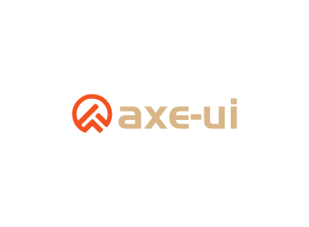

<!-- # axe-ui -->
<p align="center" style=" margin: -100px 0">
   
</p>


<p align="center">
  <!-- <a href="https://travis-ci.org/DFE-evernote/axe-ui">
    
  </a>
  <a href="https://coveralls.io/github/DFE-evernote/axe-ui?branch=main">
    
  </a> -->
  <!-- <a href="https://cdnjs.com/libraries/axe-ui">
    
  </a> -->
  <a href="https://www.npmjs.org/package/axe-ui">
    
  </a>
  <a href="https://npmcharts.com/compare/axe-ui?minimal=true">
    
  </a>
  <br>
  <a href="http://img.badgesize.io/https://unpkg.com/axe-ui/dist/axe.umd.js?compression=gzip&label=gzip%20size:%20JS">
    
  </a>
  <a href="http://img.badgesize.io/https://unpkg.com/axe-ui/dist/axe.css?compression=gzip&label=gzip%20size:%20CSS">
    
  </a>
  <a href="LICENSE">
    
  </a>
</p>


<div align="center" style="margin-bottom: 50px">
   基于vue-next的一套PC端前端UI组件库
</div>

## 技术栈
* [Vue3.0](https://cn.vuejs.org/)
* [TypeScript](https://www.tslang.cn/)
* [Dart Scss](https://sass-lang.com/)
* [Mocha](https://mochajs.org/) + [chai](https://www.chaijs.com/)
* [Eslint](https://eslint.bootcss.com/)

## 目录结构
```bash
.
├─ README.md
├─ package.json
├─ docs # 组件使用文档
│  └─ button.md
├─ packages # 组件源码
│  ├─ button # 单组件
│  │  ├─ src
│  │  │  └─ button.vue
│  │  └─ axe.umd.js
│  └─ axe.umd.js # 全部组件入口
├─ public
│  ├─ img
│  │  └─ icons # 存放pwa 图标
│  ├─ favicon.ico
│  ├─ index.html
│  └─ robots.txt
├─ src # demo样式
│  ├─ components # 存放单元组件使用Demo
│  ├─ App.vue
│  └─ main.ts
├─ styles # 组件样式
│  ├─ common
│  │  ├─ _var.scss # 全局scss变量
│  │  └─ xxx.scss
│  ├─ mixin # 混合
│  │  └─ xxx.scss
│  └─ button.scss # 组件单样式
└─ tests
   └─ utils # 单元测试
      └─ xx.spec.ts # xx模块测试文件
```
## 依赖安装
### 1、环境要求
- `node`： 8.9+ (推荐 10+)
- `npm`： 6+

> Vue CLI  requires [Node.js](https://nodejs.org/en/) version 8.9 or above (v10+ recommended). You can manage multiple versions of Node on the same machine with [n](https://github.com/tj/n), [nvm](https://github.com/nvm-sh/nvm) or [nvm-windows](https://github.com/coreybutler/nvm-windows). 

### 2、升级cli
本项目是使用vue-cli搭建项目框架，需要用vue3，得先把vue-cli的版本升级到`vue-cli@4.5`以上：
```
npm install -g @vue/cli
```
> 因为不更新版本直接install，会报[vue-loader-v16](https://github.com/vuejs/vue-cli/pull/5718#issuecomment-673360542)相关的错。但是这个问题在[vue-cli@4.5.1修复](https://github.com/vuejs/vue-cli/blob/dev/CHANGELOG.md#bug-bug-fix-7)了。所以推荐更新的到最新版～

### 3、安装依赖：
```
npm install
```
## host配置
因为服务启动后需要访问域名，故可以先进行配置：

```
#### axe-ui
127.0.0.1 dev.axe-ui.com
```
## 开发环境（编译+热更新）
```
npm run serve
# or
npm run dev
```

## 生产环境（打包+压缩）
```
npm run build
```

## 单元测试
```
npm run test:unit
```

## 代码校验和修复
```
npm run lint
```

## 自定义配置
See [Configuration Reference](https://cli.vuejs.org/config/).

